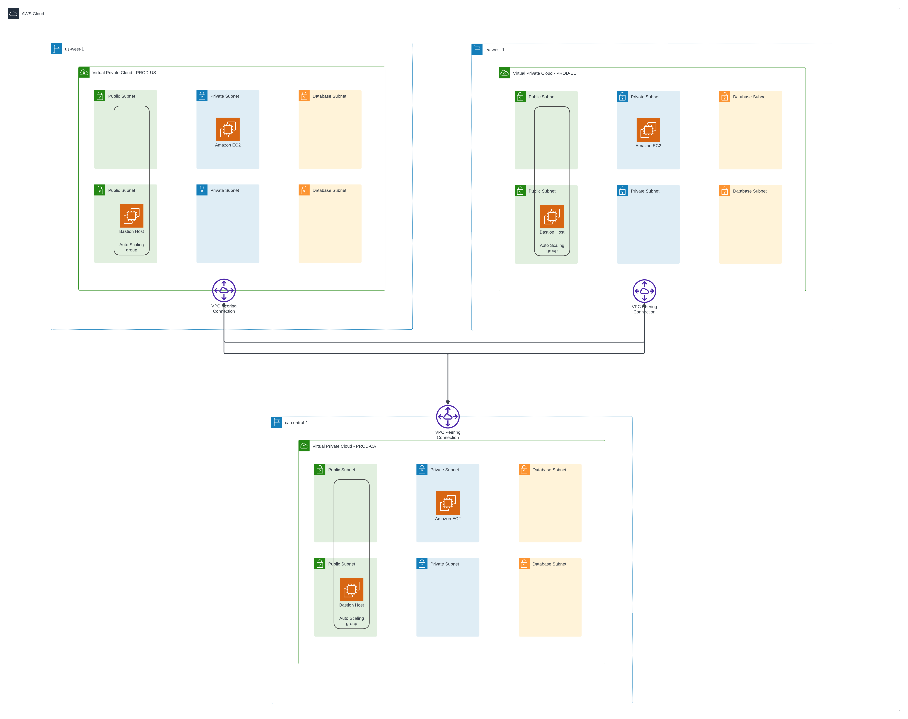

# Cilium ClusterMesh

## Situation

Need to connect Kubernetes clusters in different AWS Regions

## Task (Requirements)

- Deploy VPC with CloudFormation
  - Public with Bastion Host
  - Private with Kubernetes Node
  - Empty Database Network
- Deploy Kubernetes with Kubeadm in 3 Regions:
  - US
  - CA
  - EU
- Install Cilium as CNI
- Add VPC Peering
- Add Routes between Subnets
- Connect clusters between each other
- Check connection

## Action (Solution)

### Architecture

### Description

1. I deployed VPC with CloudFormation
2. I created Bastion and Kubernetes Host in each Region
3. I installed Kubernetes with Cilium CNI
4. I added VPC Peering
5. I added routes in Route Tables
6. I connected clusters between each other

## Result

- I deployed VPC using CloudFormation
- I deployed Kubernetes using Kubeadm
- I connected clusters using Cilium ClusterMesh
- I checked that everything works fine
