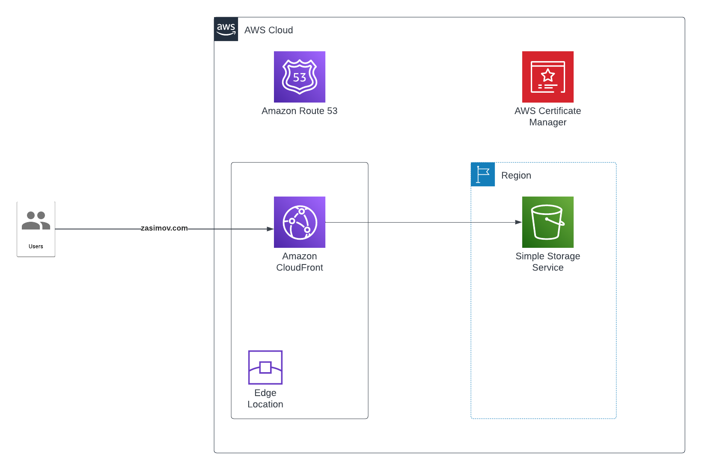

# Static Web Page on AWS S3

## Situation

Need to deploy portfolio static webpage to describe work experience

## Task (Requirements)

- Deploy static Web Page on AWS
- Content describe my experience
  - Home
  - Hard Skills Dashboard
  - Soft Skills Dashboard
  - Projects
  - Certifications
  - Contact
- Use HTML/CSS/JavaScript templates
- Create Domain and SSL certification

## Action (Solution)

### Architecture

### Description

1. I created S3
- added content
- activated static web page function
- added permisions to access data
2. I created Domain
3. I created Certification for Domain
4. I created CloudFront distribution to S3
- added alternative domain names (zasimov.com)
- added certificate for alternative domain names
5. I added A record in Route53 to CloudFront
6. I checked and tested the solution

## Result

- I deployed static Web Page on AWS
- I created content that describe my experience
- I used HTML/CSS/JavaScript template
- I created Domain and SSL certification
